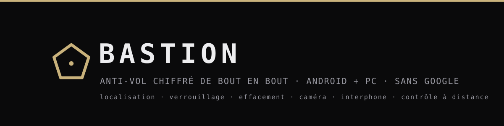
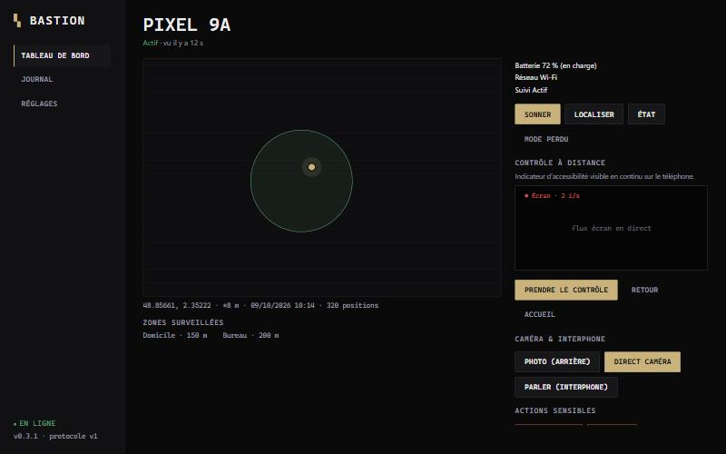
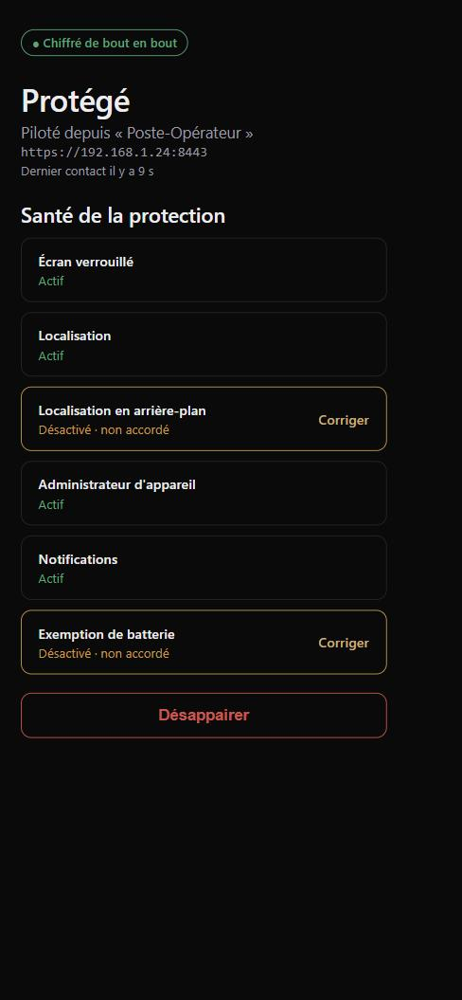

<p align="center">
  
</p>

<p align="center">
  <strong>Protection anti‑perte / anti‑vol pour Android &amp; GrapheneOS, pilotée depuis votre PC.</strong><br/>
  Sans Google, sans compte cloud, sans télémétrie. Chiffré et signé de bout en bout.
</p>

<p align="center">
  <a href="https://github.com/0x80070006/bastion/releases/latest"></a>
  
  
</p>

> *Nom de code provisoire, défini dans [`branding/product.json`](branding/product.json).*

---

## Aperçu de l'interface

| Console PC (Tauri) | Application téléphone (Android) |
|:---:|:---:|
|  |  |
| Tableau de bord, carte, contrôle à distance, caméra &amp; interphone | État de la protection et prérequis (« Santé ») |

*Aperçus — aucune donnée réelle, générés à partir des styles de l'application.*

## Ce que Bastion sait faire

- **Localiser & suivre** — position à la demande ou en continu, trace sur carte, historique.
- **Sonner** — alarme forte + flash même en silencieux, pour retrouver le téléphone.
- **Verrouiller / Effacer** — à distance, via l'administrateur d'appareil, **contresignés** par une clé privilégiée (double confirmation + délai pour l'effacement).
- **Mode perdu** — message plein écran au‑dessus de l'écran verrouillé (façon Waze), annonce **vocale** et sirène.
- **Photo anti‑intrusion** — cliché automatique après plusieurs échecs de déverrouillage, ou à la demande.
- **Caméra & micro en direct** — flux chiffrés, indicateur système toujours visible.
- **Interphone deux voies** — parler **et** entendre la personne qui tient le téléphone.
- **Contrôle à distance** — recopie de l'écran + toucher / balayage / texte / navigation, façon émulateur (voir limites plus bas).
- **Géorepérage** — zones sur la carte, alertes entrée/sortie, suivi rapproché auto hors zone.
- **Détection SIM** — alerte si la carte SIM est changée ou retirée.
- **Balises de dernière chance** — position envoyée avant extinction / batterie faible / mode avion.
- **Rotation automatique des clés** — renouvellement périodique des clés de session.

Tout transite par un **relay** qui ne voit que des blobs opaques : ni Google Play Services, ni Firebase, ni serveur tiers obligatoire.

## Composants

| Composant | Dossier | Pile |
|---|---|---|
| Bastion Mobile | [`mobile/`](mobile) | Kotlin, Jetpack Compose, Hilt |
| Bastion Desktop | [`desktop/`](desktop) | Tauri 2, Svelte 5, Rust |
| Bastion Relay | [`relay/`](relay) | Rust, axum, TLS 1.3 épinglé |
| Protocole | [`protocol/`](protocol) | Protobuf v1 + vecteurs d'interopérabilité |

Documentation : [architecture](docs/ARCHITECTURE.md) · [protocole](docs/PROTOCOL.md) ·
[menaces](docs/THREAT_MODEL.md) · [décisions](docs/DECISIONS.md) · [limites](docs/LIMITATIONS.md) ·
[permissions](docs/PERMISSIONS.md)

## Installation

Les binaires sont sur la [**page des releases**](https://github.com/0x80070006/bastion/releases/latest).

### PC (Windows)

Deux installeurs au choix :

| Fichier | Pour qui | Comportement |
|---|---|---|
| `Bastion_x.y.z_x64-setup.exe` | Installation rapide | Installeur NSIS, par utilisateur. |
| `Bastion_x.y.z_x64_en-US.msi` | Installation classique | **Demande où installer** (défaut : `C:\Program Files\Bastion`), **propose le raccourci bureau**, pour toute la machine (élévation requise). |

Lancez Bastion, choisissez un **mot de passe maître** (12 caractères minimum, **irrécupérable**) et le **relay intégré** (ou un relay distant). Autorisez Bastion sur les réseaux **privés** si Windows le demande.

### Téléphone (Android / GrapheneOS)

1. Installez `Bastion-x.y.z.apk` (sources inconnues à autoriser une fois).
2. Ouvrez Bastion, touchez **Appairer**, scannez le QR affiché par le PC (*Tableau de bord › Ajouter un téléphone*) — ou ouvrez le lien `bastion://pair…`.
3. **Comparez le code à 6 chiffres** sur les deux écrans et confirmez des deux côtés.
4. Corrigez chaque ligne de **Santé de la protection** (localisation « Toujours », administrateur d'appareil, exemption batterie, notifications).
5. *Pour le contrôle à distance uniquement* : activez **Réglages → Accessibilité → « Contrôle à distance Bastion »**.

Le relay intégré fonctionne quand le téléphone peut joindre le PC (même réseau ou redirection de port). Pour une protection partout, déployez `bastion-relay` sur un serveur :

```bash
BASTION_RELAY_LISTEN=0.0.0.0:8443 BASTION_RELAY_DATA=/var/lib/bastion bastion-relay
bastion-relay pin           # empreinte TLS à saisir dans le PC
bastion-relay admin-token   # jeton à usage unique pour enregistrer le PC
```

## Limites assumées

Bastion est une application **non root, non Device Owner**. Elle **ne contourne jamais l'écran de verrouillage** : le contrôle à distance pilote le téléphone déverrouillé (ou réveillable), mais la saisie s'arrête au code PIN — c'est une frontière de l'OS, renforcée sous GrapheneOS. La recopie d'écran tourne à **~1 image/s** (limite Android) et exige que le propriétaire active le service d'accessibilité. Toutes les captures (photo, caméra, micro, écran) laissent l'**indicateur système visible** : rien de discret. Détail complet : [LIMITATIONS.md](docs/LIMITATIONS.md).

## Développement

Prérequis : Node ≥ 22 + pnpm 10, Rust stable (+ MSVC Build Tools sous Windows,
`libwebkit2gtk-4.1-dev` sous Linux), Android SDK (plateforme 37). Le JDK 21 de Gradle est
provisionné automatiquement.

```bash
pnpm install && pnpm proto:lint && pnpm gen:check
cargo test --workspace && cargo clippy --workspace --all-targets -- -D warnings
pnpm --dir desktop test && pnpm --dir desktop tauri build          # nsis + msi
cd mobile && ./gradlew ktlintCheck detekt lintDebug test assembleRelease
```

Signature de l'APK release : `~/.bastion-signing/signing.properties` (`storeFile`,
`storePassword`, `keyAlias`, `keyPassword`) ou variable `BASTION_SIGNING_PROPERTIES` ; sans ce
fichier, l'APK release n'est pas signé.

Test de bout en bout avec un téléphone ou un émulateur :
`cargo run -p bastion-desktop --example e2e_controller -- https://<ip-du-pc>:8443`
(appairage, SAS, état, localisation, sonnerie, verrouillage contresigné, photo, caméra, audio,
géorepérage et contrôle à distance).

## Principes

- **Chiffrement et signature de bout en bout** : le relay ne voit que des blobs opaques.
- **Aucune dépendance Google Play Services / Firebase.**
- Ce que l'app **ne peut pas** faire est écrit noir sur blanc dans [LIMITATIONS.md](docs/LIMITATIONS.md).

## Licences

Applications, crates partagées et protocole : **GPL‑3.0‑or‑later** ([LICENSE](LICENSE)).
Relay : **AGPL‑3.0‑or‑later** ([relay/LICENSE](relay/LICENSE)).
